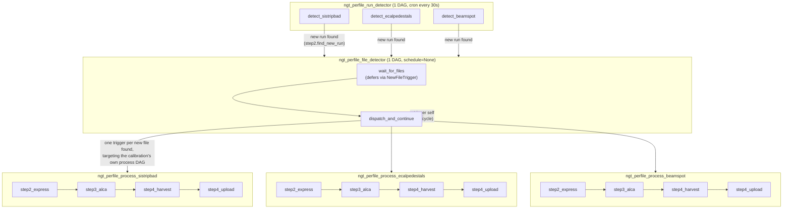
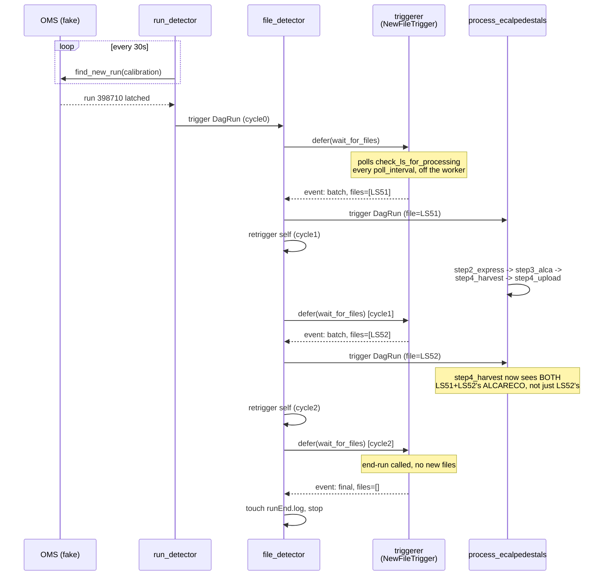

# The per-file DAG scheduling design

This documents `airflow_automation/airflow_dags/ngt_dags_per_file.py` and `airflow_automation/airflow_dags/triggers.py`: a way to
schedule the `ngt_calibration_loop` processing logic with one run detector, per-calibration
deferred file detection and one processing DagRun per input file. `ngt_dags_watch.py` schedules
the same logic with AssetWatchers instead (see its design write-up); both are built and tested
against the same fake OMS/EOS/CMSSW live-test setup, unmodified, so they can be compared head to
head with identical scripted scenarios (`scenario-player/scenario_player.py`, `scenario-player/scenarios/*.yaml`).

For a hands-on walkthrough instead of reading, run `./airflow_automation/airflow_demo/perfile_interactive_demo.sh`.

## 1. At a glance

| | `ngt_dags_per_file.py` |
|---|---|
| DAG *definitions* | 5 for 3 calibrations (2 generic + 1 process DAG per calibration) |
| Run detection | 1 DAG (`run_detector`), 1 task per calibration, cron every 30s |
| Waiting for the next input | **Deferred**: one task suspends (no worker slot) until something changes |
| Unit of retryable work | **One file**, end to end |
| Step 2 → Step 3 → Step 4 | 1 DAG per calibration (`ngt_perfile_process_{calibration}`), one straight `step2 → step3 → step4_harvest → step4_upload` chain per file |
| Step 4's input | Every ALCARECO file accumulated so far (reused from `step4.py` unchanged — see §4) |
| Extra Airflow process needed | `triggerer` (hosts the deferred wait) |
| Calibration-specific DAGs | `process`: yes, one per calibration (separately visible/pausable in the UI). `run_detector`/`file_detector`: no — generic, one task/one `conf` value per calibration |

## 2. The five DAGs



`ngt_perfile_process_sistripbad`/`_ecalpedestals`/`_beamspot` are three separate DAG
*definitions* built from one shared factory (`_build_process_dag(calibration)`), not one
generic DAG dispatched-to by conf -- so each calibration's runs, logs, and Grid view are
independently browsable/pausable in the Airflow UI.

### `ngt_perfile_run_detector`

One DAG, one task per calibration (`detect_sistripbad`, `detect_ecalpedestals`,
`detect_beamspot`), cron-scheduled every 30s.
Each task calls `step2.find_new_run(calibration)` **completely unchanged**: same OMS query, same
`min_ls_to_process` threshold, same working-directory-existence dedup (a run is only latched
once per calibration; re-detection is a no-op because `find_new_run` itself checks whether the
run's directory already exists). When a calibration latches a new run, its task triggers one
`ngt_perfile_file_detector` DagRun with `conf={"calibration", "run_number", "cycle": 0}` and a
deterministic `run_id` (`{calibration}_run{N}__cycle0`).

Why one DAG instead of one per calibration: nothing about "is
there a new run" needs its own DAG per calibration once the per-calibration *logic* already
lives in `find_new_run` — a task-per-calibration inside one DAG gives the same retry/failure
isolation and UI visibility with fewer DAG definitions to maintain.

### `ngt_perfile_file_detector`

One generic DAG — `calibration` and `run_number` come from trigger `conf`, not from the DAG
definition, so this single DAG serves every calibration and every run. Two tasks:

1. **`wait_for_files`** — a custom operator (`WaitForNewFilesOperator`) that immediately calls
   `self.defer(trigger=NewFileTrigger(...))` instead of doing any work itself. This is the
   headline mechanism of this design — see §3.
2. **`dispatch_and_continue`** — once `wait_for_files` resumes with an event
   (`{"action": "batch"|"final", "files": [...]}`), this task:
   - triggers one DagRun of that calibration's own `ngt_perfile_process_{calibration}` DAG per
     file in `files` (deterministic `run_id`, see §5 on why that's a safe dedup mechanism on
     its own);
   - if `action == "final"`: calls `step2.finalize_cycle(ctx, None, ...)` to touch `runEnd.log`
     (the marker `step2.finalize_cycle` has always written for a finished run) and stops — no further
     retrigger;
   - otherwise: triggers a fresh `ngt_perfile_file_detector` DagRun for the next cycle of the
     same `(calibration, run_number)`, self-retriggering-DagRun idiom (chosen over having `wait_for_files` just `defer()` again from
     inside `execute_complete` in an unbounded loop, so DagRun history stays one row per cycle —
     which also keeps cross-DAG dedup queryable).

### `ngt_perfile_process_{calibration}`

One DAG *per calibration* (`ngt_perfile_process_sistripbad`, `_ecalpedestals`, `_beamspot`),
each built from the same factory (`_build_process_dag(calibration)`, task callables closing
over `calibration`) rather than one
shared DAG parameterized by conf -- unlike `file_detector`, an operator browsing this design's
process history in the Airflow UI wants each calibration's runs/logs/Grid view separate. Triggered once per **input file** —
`conf={"run_number", "file"}` (no `"calibration"` -- it's implied by which DAG got triggered).
A straight four-task chain, no latching/batching-decision logic inside it at all, because the
file-detector already decided exactly which one file this run is for:

- **`step2_express`** — `step2.prepare_express_job(ctx, {that one file})` +
  `run_express_job` + `finalize_cycle`. Retry policy: 3 retries, 2 min exponential backoff, 2 h timeout.
- **`step3_alca`** — `step3.prepare_alca_prompt_job(ctx, {step2's one output file})` +
  `run_alca_prompt_job` + `finalize_cycle`. Same retry policy. No merging across files: this
  design's explicit scoping (see §4) has Step 3 act on exactly the one file Step 2 just
  produced, never a batch.
- **`step4_harvest`** — calls `step4.check_files_for_processing(ctx)` **unchanged**, which
  already returns *every* ALCARECO file accumulated for the run so far (`step4.py`'s
  pre-existing "reprocess everything" behavior, not something this design added), then
  `prepare_harvesting_job` + `run_harvesting_job`.
- **`step4_upload`** — decoupled retry policy (5 retries, 1 min backoff, 30 min timeout), so a transient condDB failure doesn't force
  redoing the harvest.

## 3. Why "defer" (not just polling more often)

Cron-scheduled DAGs such as `run_detector` already poll cheaply (a fresh, fast DagRun every 30s). The problem
`wait_for_files` solves is different: **one file-detector DagRun stays logically "in flight" for
an entire LHC run**, which can be hours long. Polling that with a worker-occupying task would
mean holding a worker slot the whole time (or accepting minutes-long gaps between checks to avoid
that).

A **deferred** task instead hands its wait off to Airflow's `triggerer` process:
`WaitForNewFilesOperator.execute()` calls `self.defer(trigger=NewFileTrigger(...),
method_name="execute_complete")` and returns immediately — the worker slot is freed. The
trigger's `async def run()` (in `airflow_automation/airflow_dags/triggers.py`) then polls
`step2.check_ls_for_processing` on a short interval (`NGT_FILE_POLL_SECONDS`, default 5s) *inside
the triggerer*, which can multiplex many such waits on one event loop far more cheaply than one
worker slot per wait. `check_ls_for_processing` does blocking file I/O and an OMS HTTP call, so
each poll runs via `asyncio.to_thread` rather than directly on the event loop — otherwise one
slow OMS response would stall every other calibration/run currently deferred alongside it.



**The cost of this**, stated plainly rather than glossed over: a calibration that never gets a
single matching file for an OMS-visible run (e.g. a test scenario that only seeds SiStripBad,
while EcalPedestals'/BeamSpot's own `run_detector` tasks *also* eagerly latch that run number --
`oms.find_new_run` latches any calibration onto any currently-running OMS run, regardless of
whether files ever show up for it) parks that calibration's
`wait_for_files` task in a **deferred** state until `step2.check_ls_for_processing` gives up --
not a cheap periodic no-op, and confirmed live to genuinely sit in Airflow's `running` state the
whole time. The underlying give-up timer comes from `ngt_calibration_loop` (`step2.py`'s
`max_latch_time_hours`, 8h in production), unchanged. `wait_for_files` also carries its own 10h
`defer(timeout=...)` as an outer safety bound independent of that, in case the give-up logic
itself never fires.

**This is no longer an 8-hour problem for the live-test setup specifically**: that timer (and
Step 3/4's own 9h/8h equivalents) is now an optional, backward-compatible calibrationYAML
override (`step_2_config.maxLatchTimeHours`, `step_3_config`/`step_4_config.timeoutSeconds`),
and `scenario-player/seed.py`'s `cmd_setup` patches the scratch calibrationYAML copies with a short value
(15 min by default) specifically so a scenario like the one above resolves in minutes instead of
hours -- confirmed live end to end (see README.md's "Resetting state" section for the full
rationale/env vars, `NGT_TEST_MAX_LATCH_TIME_HOURS`/`NGT_TEST_STEP_TIMEOUT_SECONDS`). Production
calibrationYAML has neither key, so this changes nothing there.

A related, separate operational finding surfaced while verifying this: resetting
`$NGT_DEV_HOME` (`scenario-player/sim_env.sh reset`) while Airflow's processes are *already running* with an
in-flight deferred `wait_for_files` task left it stuck indefinitely regardless of the timeout fix
above (the underlying `check_ls_for_processing` call resolves correctly when invoked fresh --
the *already-running* triggerer process itself needed a restart to notice). `airflow_automation/airflow_demo/airflow_demo.sh
reset-scenario` now wraps `sim_env.sh`'s reset+setup with a stop/restart of Airflow's processes
for exactly this reason -- see README.md's "Resetting state" section.

**A second, sharper gap remained even after the above**: `max_latch_time_hours` is measured from
run *start*, not run *end*. A run that runs for 3 hours out of an 8-hour production budget, then
ends, with a calibration whose files never fully reconcile, still leaves `wait_for_files` deferred
for the *remaining* ~5 hours -- confirmed live as the exact symptom this section originally just
described as an inherent cost. Fixed in `airflow_automation/airflow_dags/triggers.py`'s `NewFileTrigger` specifically
(not `step2.py`): each poll that comes back `"wait"` additionally queries OMS directly
(`oms.run_end_time`, a small additive function with no effect on `step2.py`'s own decision logic) and gives up once the run has been
*ended* for `run_end_grace_seconds` -- independent of how much of `max_latch_time_hours`'s
run-start-relative budget is left. Production default 30 min
(`triggers.DEFAULT_RUN_END_GRACE_SECONDS`); `NGT_FILE_DETECTOR_RUN_END_GRACE_SECONDS` overrides
it (`airflow_automation/airflow_demo/airflow_demo.sh`'s `demo_env_exports` sets 20s for the live-test setup, comfortably above
`NGT_LOOP_SLEEP_SECONDS`/`NGT_FILE_POLL_SECONDS`'s 10s/5s poll cadence). This is deliberately kept
local to this design's own trigger rather than folded into `step2.py`'s shared
`_run_has_ended_and_files_are_ready` -- `max_latch_time_hours` still applies unchanged (the
fallback for "the run never ends at all"), and only this design has the
single-long-lived-deferred-wait shape that makes a run-end-relative grace period specifically
valuable.

## 4. The batching-semantics decision

Running all three steps as one four-task chain per file forces an explicit decision about
what "per file" actually means for each step, since batching LS/files together is what lets
Step 3's merge and (especially) Step 4's harvest benefit from more statistics per job:

- **Step 2 and Step 3 act on exactly one file, always.** No merging, no `maximumFilesPerJob`
  batching decision — the file-detector already decided which single file this DagRun is for.
- **Step 4 is the deliberate exception.** It re-harvests and re-uploads from *every* ALCARECO
  file accumulated for the run so far, every single time a new file finishes Step 3 — reusing
  `step4.check_files_for_processing`/`prepare_harvesting_job` completely unchanged, since that
  "reprocess everything" behavior is already exactly what `step4.py` does (see its module docstring). The *execution flow* is still one DagRun per file; Step 4 just
  looks at more than its own triggering file's data.

This means two per-file `process` DagRuns launched close together can legitimately compute the
*same* accumulated harvest set and converge on the same content-hashed `harvestJob_<hash>`
directory — observed live during verification (two DagRuns racing to a 3-file harvest both
landed in the same job dir, one finding it already `mkdir`'d). This is correct, not a bug: it's
exactly what `step4.py`'s existing idempotent, content-hashed job-dir naming (shared, unmodified
by this design) is for.

## 5. Dedup: deterministic `run_id`, not pre-checked history

Per-file dispatch dedupes without querying DagRun history: `run_id` is a deterministic hash of `(run_number, file_path)`
(`_job_run_id_for_file`), and `airflow_api.trigger_dag_run` now treats Airflow's own 409
(duplicate `run_id`) response as an idempotent no-op instead of an error. A file rediscovered
across file-detector cycles, or a retried `dispatch_and_continue` task, safely re-attempts the
same trigger call and gets silently no-op'd rather than double-processing the file.

`_job_run_id_for_file` takes no `calibration` argument -- unlike `file_detector`'s run_ids
(which do carry a calibration prefix, since one generic DAG needs it to tell runs apart), a
process run_id doesn't need one: which calibration a run belongs to is already implied by which
`ngt_perfile_process_{calibration}` DAG it's under (see §2). The hash alone is what guarantees
uniqueness, but `_job_run_id_for_file` also folds in the lumisection number when it can parse
one out of the file's name (`scenario-player/seed.py`'s raw-file naming convention, `run{run}_ls{ls:04d}.
root`) purely for readability — `run398800__ls0051__a1b2c3d4e5f6` reads a lot better in the
Airflow UI/CLI than the hash alone, and a differently-named real EOS file that doesn't match the
convention just falls back to `run398800__a1b2c3d4e5f6` without losing dedup safety.

## 6. Running and testing this design

```bash
./airflow_automation/airflow_demo/airflow_demo.sh setup
./airflow_automation/airflow_demo/airflow_demo.sh start              # now launches 4 processes: scheduler, dag-processor,
                                          # API server, and triggerer (needed by wait_for_files)
./airflow_automation/airflow_demo/airflow_demo.sh unpause-perfile    # one call, not one per calibration/DAG (5 DAGs total)
python3 scenario-player/scenario_player.py scenario-player/scenarios/basic_ecal_pedestals.yaml
./airflow_automation/airflow_demo/airflow_demo.sh pause-perfile
```

For a paced, narrated walkthrough (including a forced-failure/retry demonstration), run
`./airflow_automation/airflow_demo/perfile_interactive_demo.sh` — see its `--help` for options.

`tests/airflow_designs/test_dags_per_file.py` covers DAG wiring, every task callable, and `NewFileTrigger`'s
async `run()` directly (driven to its first event with a single `asyncio.run()`, no
`pytest-asyncio` needed) — guarded by `pytest.importorskip("airflow")`.
