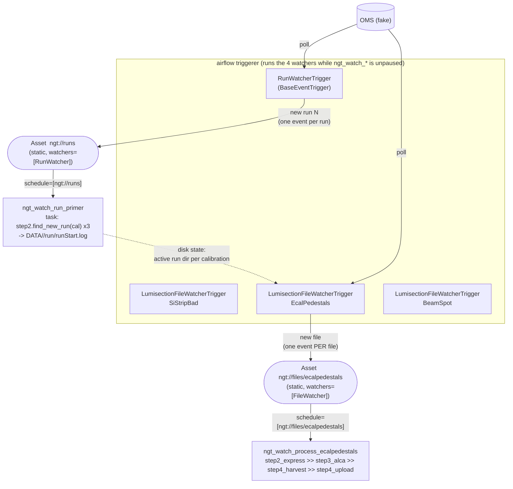

# The AssetWatcher (all-static-asset) DAG scheduling design

This documents `airflow_automation/airflow_dags/ngt_dags_watch.py` (with the two new triggers in
`airflow_automation/airflow_dags/triggers.py` and the shared `airflow_automation/airflow_dags/_perfile_process.py`): an
event-driven way to schedule the `ngt_calibration_loop` processing logic, independently
selectable from the per-file design (`ngt_dags_per_file.py`, deferred per-file). Same
unmodified library, same fake OMS/EOS/CMSSW live-test setup, so both compare head-to-head with
the identical scripted scenarios.

Its governing principle: **every asset declared statically, driven by `AssetWatcher`s, zero
cron/polling DAGs, no dynamically-named assets.** §1 below introduces the Airflow-3 Asset
machinery it is built out of; §6 covers why the dynamically-named alternative is not on the
table.

For a hands-on walkthrough, run `./airflow_automation/airflow_demo/watch_interactive_demo.sh`.

## 1. Intro: Airflow assets overview

An **`Asset`** in Airflow 3 is a named piece of data or state — "the list of current runs",
"this calibration's new lumisection files". DAGs *produce* assets (a task declares
`outlets=[asset]`) and DAGs *consume* them (`schedule=[asset]` in place of a cron expression).
Every production records an **`AssetEvent`**, and an event on a consumed asset is what makes
Airflow create the consumer's DagRun. That is Airflow's native event-driven alternative to
time-based scheduling: nothing runs on a clock, things run because something changed. (This is
the Airflow-2 `Dataset` under its new name; Airflow 3.0 renamed it and added the machinery
below.)

Airflow 3 additionally lets the *producer* be something other than a task. An **`AssetWatcher`**
attaches a deferrable trigger to an Asset: the trigger runs continuously in the **triggerer**
process, and each `TriggerEvent` it yields becomes an `AssetEvent` on that Asset. External state
(OMS, EOS, a file on disk) can therefore update an asset directly — no DAG, no task and no
DagRun are involved in the watching itself. This design is built entirely out of that: four
static Assets, four watchers, and DAGs that exist only to do work once a watcher says there is
work.

The pieces it uses, verified against the installed Airflow 3.3.1:

| Piece | Import | What it is |
|---|---|---|
| `Asset` | `airflow.sdk.Asset` | A named, **statically declared** (parse-time) unit of data/state. `Asset(name, watchers=[...])`. Four here: `ngt://runs` and `ngt://files/<cal>` ×3. |
| `AssetWatcher` | `airflow.sdk.AssetWatcher` | `AssetWatcher(name: str, trigger: BaseEventTrigger)` — attaches a custom trigger to an Asset. |
| `BaseEventTrigger` | `airflow.triggers.base.BaseEventTrigger` | A `BaseTrigger` subclass marking a trigger as watcher-compatible. Same `async def run() -> AsyncIterator[TriggerEvent]` contract as a normal deferred-task trigger — `RunWatcherTrigger` and `LumisectionFileWatcherTrigger` (§3) are both this, and the per-file design's `NewFileTrigger` was already 95% this shape. |
| `AssetStateStore` | injected as `self.asset_state_store` on a watcher's trigger | Per-Asset key/value store (AIP-103, Airflow 3.3) writable from a trigger that has no task instance. This design keeps each watcher's record of what it has already emitted there — see §4. |
| Shared-stream triggers | `BaseEventTrigger.shared_stream_key`/`open_shared_stream`/`filter_shared_stream` | Multiple trigger instances (e.g. one per calibration) whose `shared_stream_key()` compares equal share **one** underlying poll loop in the triggerer; each still gets its own filtered `TriggerEvent`s. Not used yet — see §5. |
| `AssetAlias` | `airflow.sdk.definitions.asset.AssetAlias` | Lets a *task* dynamically resolve which concrete asset it just produced, at execution time (via `outlets`). **Not** a watcher mechanism, and the reason per-run assets are not an option — see §6. Unused here. |
| `AssetAny` / `AssetAll` | `airflow.sdk.AssetAny/AssetAll` | Boolean combinators for `schedule=[...]` (OR/AND across several assets). Unused here — each DAG consumes exactly one Asset. |
| `@asset` decorator | `airflow.sdk.asset` | Decorates a materialization function into an Asset plus an auto-generated tiny DAG; also accepts `watchers=`. A convenience layer over the same `Asset(...)`/`AssetWatcher(...)` primitives — unused here, since we want the watcher *without* an auto-materializer DAG. |

The whole pattern, in Airflow's own canonical example
(`airflow/example_dags/example_asset_with_watchers.py`):

```python
single_file_trigger = FileDeleteTrigger(filepath="/tmp/test")
single_file_asset = Asset("example_asset", watchers=[AssetWatcher(name="test_asset_watcher", trigger=single_file_trigger)])

with DAG(dag_id="example_asset_with_watchers", schedule=[single_file_asset, ...], catchup=False):
    ...
```

Three properties of that machinery are what the rest of this document builds on:

- **Watchers are infrastructure, not task state.** They are registered in the metadata DB during
  DAG *parsing* (`AssetWatcherModel`, tied to the same `Trigger` table deferred tasks use) and
  run continuously in the triggerer — **not** tied to any DagRun's lifecycle. This is the single
  biggest architectural difference from the per-file design, where `ngt_perfile_file_detector`
  must retrigger itself (`dispatch_and_continue` → a fresh DagRun) to keep watching after each
  cycle. A watcher's trigger is instead simply restarted by the triggerer after it yields, with
  no DAG-run-level bookkeeping at all. Its flip sides are two of §5's caveats: that restart is
  also a re-yield window, and a watcher only runs while its consuming DAG is unpaused.
- **A trigger's payload reaches the consumer verbatim.** `Trigger.submit_event`
  (`airflow/models/trigger.py`) calls `AssetManager.register_asset_change(extra={"from_trigger":
  True, "payload": event.payload}, ...)`, so whatever dict a watcher's `TriggerEvent(...)`
  carries becomes `AssetEvent.extra["payload"]` unchanged. That is how `{"run_number": N,
  "file": f}` gets from `LumisectionFileWatcherTrigger` to `ngt_watch_process_<cal>` without any
  serialization of our own.
- **Consumers read it from the task context.** `Context.triggering_asset_events:
  Mapping[str, Collection[AssetEvent]]` — a task in a DAG scheduled on `schedule=[some_asset]`
  reads `context["triggering_asset_events"]` for the `AssetEvent`(s) that fired it, each
  carrying `.extra["payload"]`. Live, that mapping is keyed by the `Asset` object rather than by
  a bare string despite the type hint, which is why
  `_perfile_process.run_and_file_from_context` iterates its *values* instead of looking a key up.

```mermaid
sequenceDiagram
    participant OMS as OMS (fake)
    participant TRG as triggerer<br/>(a watcher's trigger, e.g. RunWatcherTrigger)
    participant AST as Asset (static)
    participant DAG as consumer DAG<br/>(schedule=[asset])

    Note over TRG: registered at DAG-parse time,<br/>runs continuously -- no DagRun needed
    loop poll
        TRG->>OMS: check for a new run
    end
    TRG-->>AST: TriggerEvent({"run_number": ...}) -> AssetEvent(extra={"payload": {...}})
    AST->>DAG: trigger DagRun
    DAG->>DAG: read context["triggering_asset_events"][asset][0].extra["payload"]
    Note over TRG: trigger returns; triggerer restarts it<br/>and it keeps watching
```

## 2. At a glance

| | `ngt_dags_per_file.py` | `ngt_dags_watch.py` (this design) |
|---|---|---|
| Run discovery | cron DAG (`ngt_perfile_run_detector`, every 30s) | `AssetWatcher` on `Asset("ngt://runs")` — a `BaseEventTrigger` in the triggerer, **no cron DAG** |
| File discovery | deferred `NewFileTrigger` inside `ngt_perfile_file_detector` (one DagRun in flight per calibration and run) | `AssetWatcher` on `Asset("ngt://files/<cal>")` ×3 — **no DagRun exists while idle** |
| Assets | none | **4, all static**, all with watchers: `ngt://runs`, `ngt://files/{sistripbad,ecalpedestals,beamspot}` |
| Hand-offs | `trigger_dag_run` (run detector → file detector → process) | **Asset events only** |
| DAG count | 5 | **4** (1 primer + 3 process) |
| Cron DAGs | 1 | **0** |
| Dedup state | deterministic `trigger_dag_run` run_id | **`AssetStateStore`** watermark on each Asset (+ `step2`'s `allLSProcessed.log`) |
| Extra process | `triggerer` | `triggerer` (hosts the watchers) |

## 3. The four DAGs + four watchers



(`ngt://files/sistripbad` / `ngt://files/beamspot` and `ngt_watch_process_{sistripbad,beamspot}`
are identical, each wired to their own calibration's file asset.)

### `Asset("ngt://runs")` + `RunWatcherTrigger`

Registered on `ngt_watch_run_primer`'s `schedule=[Asset("ngt://runs", watchers=[AssetWatcher(...)])]`.
While that DAG is unpaused, the triggerer runs `RunWatcherTrigger.run()` continuously:

- polls `oms.find_new_run(...)` — **calibration-agnostic**: `filltype: "PROTONS"` and
  `l1hltmode: "collisions2026"` are identical across all three calibration YAMLs, so one query
  (using the first calibration's config) covers every calibration. It is `oms.find_new_run`
  (pure query, **no side effects**), not `step2.find_new_run` (which creates directories — that
  is the primer's job).
- on a genuinely-new run it yields `TriggerEvent({"run_number": N, "run_start_time": ...})`, which
  updates `Asset("ngt://runs")` and triggers `ngt_watch_run_primer`. It then `return`s; the
  triggerer auto-restarts it (§1; confirmed live against Airflow 3.3.1).
- **dedup**: already-yielded run numbers are held in this Asset's `AssetStateStore` under
  `seen_runs` (see §4); `oms.find_new_run`'s own "working dir already exists" check is a second
  line of defence once the primer has run.

### `ngt_watch_run_primer` — `schedule=[Asset("ngt://runs")]`

One task, `prime_run`: calls `step2.find_new_run(calibration)` (**unchanged**, idempotent) for
each of the three calibrations, which creates `DATA_BASE_PATH/<cal>/run<N>/` + `runStart.log`.

This is the answer to "a run-asset update *starts* per-calibration file watching": an
`AssetWatcher` cannot be spawned by an event — it is registered at DAG-parse time and runs from
then on. The file watchers are therefore **always running**; they are just *idle* until a run
directory appears on disk for them to act on. `prime_run` creating those directories is what
sets them to work. (Disk is the shared signal because that is already `step2`'s model —
`build_run_context` reads `runStart.log`, `runEnd.log` is the run-end sentinel — and because a
file watcher's `AssetStateStore` is scoped to `ngt://files/<cal>`, so it cannot read
`ngt://runs`'s state anyway.)

### `Asset("ngt://files/<cal>")` + `LumisectionFileWatcherTrigger` (×3)

Registered on each `ngt_watch_process_<cal>`'s `schedule=`. `run()` loops:

1. **find the active run**: newest `DATA_BASE_PATH/<cal>/run*/` with `runStart.log` and no
   `runEnd.log`. If none → sleep, loop (this is the "idle until primed" state).
2. `step2.check_ls_for_processing(step2.build_run_context(<cal>, N))` — **unchanged**.
3. `action in ("batch", "final")` → of the files in `ls_to_process` not already processed
   (`step2.load_already_processed`) and not already handed out (`AssetStateStore` `emitted_run<N>`),
   **exactly one** — the lexicographically first — is added to the watermark and yielded as
   `TriggerEvent({"run_number": N, "file": f})`, then `run()` returns. The triggerer auto-restarts
   the watcher and the next scan (one `poll_interval` later) hands out the next file. Yielding
   several at once is wrong: Airflow **coalesces asset events a watcher emits in the same instant
   into a single triggered DagRun**, so all but one file would be lost (found live). On `final` with nothing
   left to hand out it writes `runEnd.log` (`step2.finalize_cycle`, `job_spec=None`), drops the
   `emitted_run<N>` watermark, and returns → restarts → step 1 finds no active run → idle.
4. run OMS-ended for `run_end_grace_seconds` with nothing new (this trigger's own check, same as
   `NewFileTrigger`) → write `runEnd.log`, return, idle.
5. otherwise sleep, loop.

### `ngt_watch_process_<cal>` — `schedule=[Asset("ngt://files/<cal>")]` (×3)

`step2_express >> step3_alca >> step4_harvest >> step4_upload`, one input file end to end;
Step 4 harvests/uploads every ALCARECO file accumulated for the run so far (`step4.py`'s own
behaviour). **Identical to `ngt_perfile_process_<cal>`**: the four
callables are the shared `airflow_automation/airflow_dags/_perfile_process.py` ones. They read `(run_number, file)`
via `_perfile_process.run_and_file_from_context(context)` — from `dag_run.conf` (the per-file design's
`trigger_dag_run`) **or** the triggering Asset event's `extra` (this design). `step2_express`
additionally skips a file already in `allLSProcessed.log` (there is no `trigger_dag_run` run_id
to 409-dedupe on here — see §5).

## 4. `AssetStateStore` — what the watchers remember between restarts

A watcher's trigger has no task instance, so the per-task memory Airflow normally offers — XCom,
task state — is not available to it, and it is restarted every time it yields an event (§1).
Without somewhere outside itself to record what it has already handed out, it would re-emit the
same run, or the same file, after every restart.

`AssetStateStore` (AIP-103, Airflow 3.3) is a key/value store **scoped to an Asset identity**
(table `asset_state_store`, `(asset_id, key) → JSON`). It is the sanctioned replacement for
"keep a watermark in an Airflow Variable", and its model docstring explicitly supports writes
from watchers (`BaseEventTrigger`) that have no task instance. It survives triggerer restarts
and DAG-run cleanup, and is removed with the Asset via `ON DELETE CASCADE`. Public REST API
`/api/v2/assets/{id}/state-store`; no CLI.

This design uses it for exactly the two things the watchers need to remember across restarts:

| Asset | key | value |
|---|---|---|
| `ngt://runs` | `seen_runs` | list of run numbers `RunWatcherTrigger` has already emitted |
| `ngt://files/<cal>` | `emitted_run<N>` | list of file paths that calibration's file watcher has already emitted for run `N` (deleted when the run finalizes) |

Keeping the watermarks **on the static assets themselves** matches the "everything static"
spirit of the design, and `./airflow_automation/airflow_demo/airflow_demo.sh reset-watch` deleting the Asset rows clears the
watermarks for free (CASCADE). The triggerer injects `self.asset_state_store`
(`triggerer_job_runner.py`) scoped to the trigger's watched assets; the triggers access it with
`self.asset_state_store[Asset(name=…, uri=…)].get/set/delete(…)`.

**Fallback.** If `self.asset_state_store` is not injected (older Airflow, or a name mismatch),
the triggers fall back to a plain on-disk log — `DATA_BASE_PATH/_ngt_watch_runs_seen.log` for
the run watcher, `<working_dir>/_ngt_watch_emitted.log` for a file watcher — same semantics.
The live test records which path was actually exercised.

## 5. Costs / caveats

- **One event per `run()` invocation (mandatory).** Airflow coalesces asset events a watcher
  emits in the same instant into a single triggered DagRun, so `LumisectionFileWatcherTrigger`
  yields at most one file then returns (§3). Consequence: back-to-back files are handed out one
  `poll_interval` apart, not instantly. Found live — before the fix, a poll that saw two new
  files at once processed one and permanently lost the other (and then looped forever on it,
  never writing `runEnd.log`).
- **Triggerer-restart re-yield window.** A watcher trigger restarts after each yield (or on
  triggerer restart). Between a file being yielded and `ngt_watch_process_<cal>`'s `step2_express`
  appending it to `allLSProcessed.log`, a restarted file watcher could re-yield it — and unlike
  #2/#3 there is no deterministic `trigger_dag_run` run_id, so Airflow would create a second
  `asset_triggered__…` DagRun. Two guards: the `AssetStateStore` `emitted_run<N>` watermark
  (persisted immediately, before the yield) and `step2_express`'s skip-if-already-processed.
- **`runEnd.log` written by a trigger.** The file watcher calls `step2.finalize_cycle` as a side
  effect (like std-lib `FileDeleteTrigger` `unlink`s its file). Per-calibration.
- **One run-discovery path at a time.** Both designs share the on-disk
  `DATA/<cal>/run<N>/` working-dir dedup; two run detectors/watchers unpaused at once race.
  `./airflow_automation/airflow_demo/watch_interactive_demo.sh` pauses the per-file design first.
- **Watchers only run while their consuming DAG is unpaused** (`dag_processing/collection.py`).
  Pausing `ngt_watch_*` stops all four watchers — which is also how you "leave it paused".
- **Cold start.** A `schedule=[Asset(…)]` DAG is not schedulable until the asset first has an
  event; the run watcher produces the first `ngt://runs` event itself once unpaused, so a normal
  deploy just works.
- **No `shared_stream_key` fan-out** yet — the three file watchers + run watcher each run their
  own OMS/EOS poll loop. `BaseEventTrigger.shared_stream_key` / `open_shared_stream` /
  `filter_shared_stream` could collapse them to one shared poll; noted as a follow-up.

## 6. Comment on alternative designs: why per-run Assets aren't a viable approach

An alternative design allowing for better tracking of the state of a given LHC run in the UI
could be "one Asset per run" — `Asset(f"ngt://run/{N}")`, watched by a trigger that knows only
about run `N`, consumed by a process DAG scheduled on exactly that run. It is not expressible in
Airflow 3, and that constraint is what gives this design its shape. Each single run is better
expressed as an `AssetEvent`, with its number stored in the `payload`, rather than as an `Asset`
named with the run.

- **Assets must be declared statically, at DAG-parse time.** `AssetWatcher` takes one concrete
  `Asset` object, not a dynamically-named one, and a DAG's `schedule=[...]` list is likewise
  fixed when the file is parsed. Run numbers are unbounded and not known ahead of time, so "one
  Asset per run" is not representable the way "one Asset per calibration" is — even if a run
  asset could somehow be minted mid-flight, no DAG would be scheduled on it. ("One Asset per
  file instance" fails the same way, more so.)
- **`AssetAlias` is not the escape hatch it looks like.** It advertises dynamic resolution, but
  its docstring is explicit about the direction: it lets a *task* declare, at execution time,
  which concrete asset it just produced via `outlets`. It is a producer-side naming mechanism —
  it cannot attach a watcher trigger to a dynamically-named thing, and it only resolves from
  inside a running task, which is precisely what this design deliberately does not have while
  idle.

So the constraint is on per-run **watching**, not on per-run **work**: dispatching one DagRun per
`(run, file)` is fine — the per-file design does it with `trigger_dag_run` and a deterministic
run_id, and `ngt_watch_process_<cal>` does the same work one asset event at a time. Everything
per-run in this design is therefore carried *around* the asset identity rather than in it:

- **Calibration is the asset key** — fixed, small, parse-time-known — and there are exactly four
  assets forever, whatever the LHC does.
- **`run_number` and `file` travel as event payload**, not as identity:
  `TriggerEvent({"run_number": N, "file": f})` → `AssetEvent.extra["payload"]` (§1), read back
  by `_perfile_process.run_and_file_from_context`.
- **Per-run state is a per-run *key* in a static Asset's `AssetStateStore`** (`emitted_run<N>`,
  §4), deleted when the run finalizes — instead of a per-run asset that would have to be
  garbage-collected.
- **The on-disk run directory is what tells a file watcher which run is active** (`prime_run`,
  §3). A watcher cannot be handed a run number by an event, because it is not *started* by one —
  it was already running before the run existed.

The cost of routing run identity through payload and disk rather than asset identity is §5's
re-yield window: with no per-run asset and no deterministic `trigger_dag_run` run_id, nothing at
the Airflow level rejects a duplicate, so the `emitted_run<N>` watermark and `step2_express`'s
skip-if-already-processed carry that weight instead.

## 7. Testing

`tests/airflow_designs/test_dags_watch.py` — same shape as `tests/airflow_designs/test_dags_per_file.py`: DagBag wiring (both
designs parse together; each watch DAG is `AssetTriggeredTimetable`, no cron), and the new
triggers' async `run()` driven to completion with an in-memory fake `AssetStateStore` —
`RunWatcherTrigger` yields for a new run / skips a seen run / falls back to disk with no store;
`LumisectionFileWatcherTrigger` yields one event per new file, skips emitted files, finalizes on
`check_ls_for_processing` `final` or the OMS run-end grace, stays idle with no run dir. Plus
`prime_run` (creates the 3 working dirs, idempotent) and `run_and_file_from_context` (conf and
Asset-event shapes). Run: `pytest tests/airflow_designs/test_dags_watch.py`.
