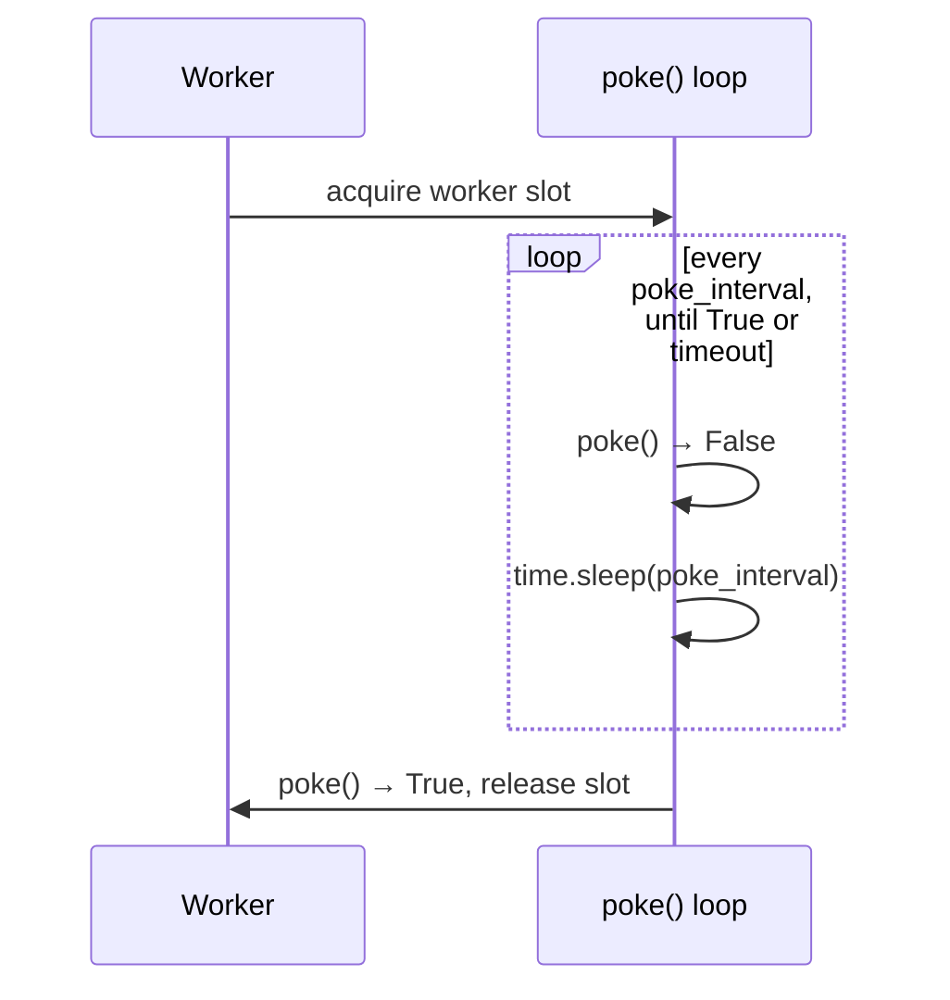
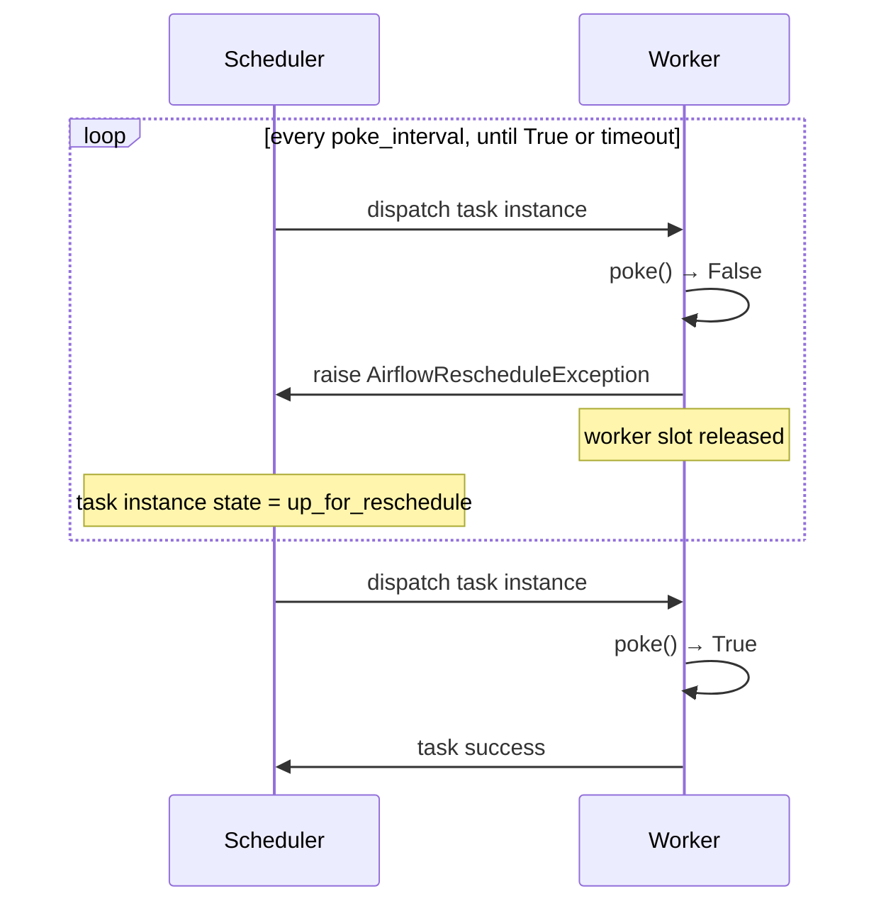
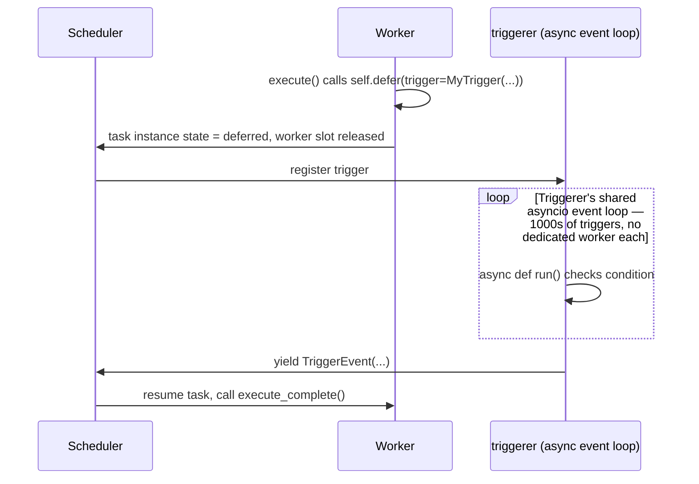

# Airflow sensors: syntax and mechanism guide

Companion reference to [`scheduling_options.md`](scheduling_options.md)'s trigger-type
analysis. That document decides *what* should wake up a workflow for each trigger type
(API polling, filesystem polling, push); this one explains *how* Airflow's own mechanisms
— sensors, deferrable triggers, and Datasets — implement each of those, with working
syntax against Airflow 2.10 (the version this repo installs).

## 1. What a sensor actually is

A `Sensor` is a normal `BaseOperator` subclass with one difference: instead of doing work
once in `execute()`, it implements `poke(self, context) -> bool`, and the base class calls
`poke()` repeatedly — on a timer — until it returns `True` or a timeout elapses.

```python
from airflow.sensors.base import BaseSensorOperator

class NewRunSensor(BaseSensorOperator):
    def poke(self, context) -> bool:
        return oms.find_new_run(...) is not None
```

That's the entire mechanism. Everything else (§2-§5 below) is about *how* the repeated
checking is scheduled — whether it holds a worker slot, releases it between checks, or
doesn't use a worker at all.

## 2. Constructor parameters that matter here

| Parameter | Meaning | Default |
|---|---|---|
| `poke_interval` | seconds between checks | 60 |
| `timeout` | max total seconds before the sensor fails | 7 days |
| `mode` | `"poke"` \| `"reschedule"` (§3/§4) | `"poke"` |
| `soft_fail` | timeout → task marked `skipped` instead of `failed` | `False` |
| `exponential_backoff` | grow `poke_interval` over time (capped) instead of fixed cadence | `False` |
| `retries` / `retry_delay` | standard operator retry, for *exceptions raised inside* `poke()` — distinct from "condition not yet true," which is not an error | inherited from operator defaults |

`timeout` vs `retries` is a common confusion: a sensor that pokes 50 times and gets `False`
every time is behaving *correctly* (the condition just hasn't happened yet) and eventually
fails on `timeout`, not on retry exhaustion. `retries` only fires if `poke()` itself raises
(e.g. the OMS query errors out) — that's a transient-failure retry, orthogonal to the
patient waiting `poke_interval`/`timeout` express.

## 3. Poke mode (default) — do not use for anything in this pipeline



The task instance holds a worker slot for the **entire** wait, sleeping in-process between
checks. A run can take hours to appear or finish; holding a worker slot for hours starves
every other task queued behind it. **Never use `mode="poke"` for a wait that can exceed a
couple of minutes** — which is every wait in this pipeline (run latching, file-batch
accumulation, upload confirmation).

## 4. Reschedule mode — the default choice for this pipeline

```python
wait_for_run = NewRunSensor(
    task_id="wait_for_new_run",
    mode="reschedule",
    poke_interval=30,
    timeout=60 * 60 * 8,
)
```



Each `False` poke raises `AirflowRescheduleException` internally; the task instance goes to
`up_for_reschedule`, the worker slot is released, and the scheduler re-dispatches it after
`poke_interval`. No worker slot is held between checks — this is the mode to reach for
whenever a literal `Sensor` operator is used in this codebase.

## 5. Deferrable (async) sensors — zero worker footprint, needs a `triggerer`



A `BaseTrigger` subclass runs inside a single shared `airflow triggerer` process's asyncio
event loop, so one triggerer can watch thousands of pending conditions with **no worker
slot consumed at all** while waiting — strictly better than reschedule mode at scale, at
the cost of running an extra long-lived process.

```python
from airflow.triggers.base import BaseTrigger, TriggerEvent
from airflow.sensors.base import BaseSensorOperator

class NewRunTrigger(BaseTrigger):
    def __init__(self, calibration_name: str):
        super().__init__()
        self.calibration_name = calibration_name

    def serialize(self):
        return ("path.to.NewRunTrigger", {"calibration_name": self.calibration_name})

    async def run(self):
        while True:
            # must be genuinely async, or it blocks every other trigger sharing this loop
            run = await asyncio.to_thread(oms.find_new_run, self.calibration_name)
            if run is not None:
                yield TriggerEvent({"run_number": run.run_number})
                return
            await asyncio.sleep(30)

class NewRunSensorAsync(BaseSensorOperator):
    def execute(self, context):
        self.defer(trigger=NewRunTrigger(self.calibration_name), method_name="execute_complete")

    def execute_complete(self, context, event):
        return event["run_number"]
```

**Caveat relevant to this repo**: `run()` must be a genuine `async` coroutine that yields
control — the current `oms.py`/`eos.py` use synchronous `requests`/`subprocess` calls, so a
naive port would block the triggerer's *shared* event loop and stall every other deferred
trigger, not just its own. `asyncio.to_thread(...)` (shown above) works around that but
spends a thread per in-flight check anyway, eroding much of the "no resources held" benefit
versus reschedule mode. A real async rewrite (`aiohttp` instead of `requests`) would be
needed to get deferrable mode's full benefit for Type A (OMS) checks. This repo's plan
already opted out of running a `triggerer` at all (see `loop_diagram.md`/plan) — reschedule
mode, or the cron-latch-DAG pattern already in place, is the right tradeoff at this scale;
revisit deferrable mode only if sensor/wait *count* grows large enough that reschedule
mode's per-check scheduler overhead becomes material.

## 6. Built-in sensors relevant to this pipeline's trigger types

| Sensor | Trigger type it fits | Fits this repo directly? |
|---|---|---|
| `airflow.sensors.python.PythonSensor` | any — wraps an arbitrary `python_callable() -> bool` | **Yes** — thinnest way to turn existing `oms.py`/`eos.py` functions into a sensor without rewriting them |
| `airflow.providers.http.sensors.http.HttpSensor` | Type A (API polling) | Partially — built for raw REST + a `response_check` callable; `oms.py` already wraps `omsapi`'s client rather than raw HTTP, so `PythonSensor` around the existing functions is a better fit than re-plumbing through `HttpSensor` |
| `airflow.sensors.filesystem.FileSensor` | Type B (filesystem polling) | Only if EOS is exposed as a standard Airflow `Connection`/hook (SFTP, or a custom `FSHook`); this repo currently shells out to `xrdfs`/`edmFileUtil` directly (matching the existing fake toolchain), so a `PythonSensor` around `eos.list_available_files()` is the direct fit, same as Type A |
| `airflow.sensors.external_task.ExternalTaskSensor` | Cross-DAG dependency without a filter condition | Situational — waits on another **DAG's** task reaching a state; could replace the manual `TriggerDagRunOperator` handoff between steps, but Datasets (§8) are a better fit here since they also solve the multi-subscriber fan-out |
| `airflow.providers.common.sql.sensors.sql.SqlSensor` | Type A-adjacent, DB polling | Not used — condDB is a write target (`uploadConditions.py`), never polled for a trigger condition here |

## 7. Custom sensor examples wrapping this repo's existing code

**Type A (OMS) — new run available:**
```python
from airflow.sensors.python import PythonSensor
from ngt_calibration_loop import step2

wait_for_run = PythonSensor(
    task_id="wait_for_new_run",
    python_callable=lambda calibration_name: step2.find_new_run(calibration_name) is not None,
    op_kwargs={"calibration_name": "SiStripBad"},
    mode="reschedule",
    poke_interval=30,
    timeout=60 * 60 * 24,
)
```

**Type B (EOS) — enough new files to batch:**
```python
from airflow.sensors.python import PythonSensor
from ngt_calibration_loop import step2

def _batch_ready(**context):
    ctx = step2.build_run_context(context["params"]["calibration_name"], context["params"]["run_number"])
    decision = step2.check_ls_for_processing(ctx)
    return decision.action in ("batch", "final")

wait_for_batch = PythonSensor(
    task_id="wait_for_batch_ready",
    python_callable=_batch_ready,
    mode="reschedule",
    poke_interval=15,
    timeout=60 * 60 * 8,
)
```

**Note on how this compares to what's actually implemented today**: neither of the above is
currently used verbatim. The existing `_latch`/`_process` DAGs achieve the same "don't hold
a worker while waiting" property via a *different* mechanism — a cron-scheduled DAG whose
task runs once, checks, and exits, rather than a long-lived `Sensor` task. See §9 for when
each shape is preferable.

## 8. Datasets (data-aware scheduling) — Airflow's built-in fan-out

This is the concrete Airflow-native mechanism for the "single poller triggers every
subscribed workflow" pattern discussed in `scheduling_options.md` — instead of hand-rolling
a subscription registry and firing `TriggerDagRunOperator` per subscriber, one producer
task marks a `Dataset` updated, and Airflow's scheduler automatically starts every DAG that
lists that `Dataset` in its own `schedule`.

```python
from airflow.datasets import Dataset
from airflow.decorators import dag, task

NEW_RUN_AVAILABLE = Dataset("oms://runs/new")

# --- producer: one shared DAG, one poll ---
@dag(schedule=timedelta(seconds=30), catchup=False, max_active_runs=1)
def ngt_run_watcher():
    @task(outlets=[NEW_RUN_AVAILABLE])
    def check_for_new_run():
        run = oms_watch_all_calibrations()   # one OMS query, not one per calibration
        return run
    check_for_new_run()

ngt_run_watcher()

# --- consumers: each scheduled automatically when the dataset updates ---
with DAG(dag_id="ngt_step2_sistripbad_process", schedule=[NEW_RUN_AVAILABLE], catchup=False):
    ...

with DAG(dag_id="ngt_step2_ecalpedestals_process", schedule=[NEW_RUN_AVAILABLE], catchup=False):
    ...
```

Mechanism: when a task with `outlets=[Dataset(...)]` succeeds, Airflow records a *dataset
event*; on its next scheduling loop, the scheduler finds every DAG whose `schedule` is (or
includes) that `Dataset` and creates a new DAG run for each. This is genuinely the same
shape as `scheduling_options.md` §3.2's hand-drawn "registry + fan-out" diagram, except the
registry *is* the `schedule=[...]` declaration on each consumer DAG — no separate config
file to keep in sync, and it's visible in the Airflow UI's "Datasets" view (which DAGs
produce/consume which datasets) for free.

**Conditional expressions** (Airflow 2.9+) compose multiple datasets:
```python
schedule=(NEW_RUN_AVAILABLE & CALIBRATION_ENABLED)   # AND — both must have new events
schedule=(NEW_RUN_AVAILABLE | OPERATOR_FORCED_RERUN)  # OR — either wakes the consumer
```

**The Type C (push) integration point**: a dataset can also be marked updated *from outside
Airflow entirely*, via `POST /api/v1/datasets/events`. This is the concrete answer to "how
would a future CERN-side webhook plug into this system": the webhook receiver would just
call that endpoint instead of Airflow polling anything, and **every already-registered
consumer DAG keeps working unmodified** — they only ever cared about the dataset, never
about who/what updated it. Building the run-watcher on Datasets now, even while it's
poll-based, means adopting push later is additive (swap the updater), not a rewrite of the
consumer side.

## 9. Cron-scheduled DAG vs literal Sensor vs Dataset — when to use which

| | Cron-scheduled DAG (used today for `_latch`) | `Sensor` (`mode="reschedule"`) | `Dataset`-scheduled DAG |
|---|---|---|---|
| Worker slot while waiting | None — each check is a short, complete DAG run | None between pokes | None — consumer DAG doesn't run at all until the event fires |
| Natural unit in the Airflow UI | One DAG run per check (many rows over time) | One task instance per wait, reschedules shown in its own log | One DAG run per *event*, not per check — no rows for "still waiting" |
| Multi-subscriber fan-out | Manual (each calibration's own DAG polls independently, or a `TriggerDagRunOperator` call per subscriber) | N/A — a sensor blocks one specific downstream, not a fan-out mechanism | **Built-in** — any number of DAGs can `schedule=[SameDataset]` |
| Best fit | A condition with no specific entity yet to attach a task to (e.g. "is there a new run *at all*") | A condition scoped to an already-known entity within one DAG run (e.g. "wait for run 398600's next file", inline in that run's own DAG) | A condition one component detects that *several independent* DAGs need to react to |
| Used in this repo | Yes, for `_latch` (§ of `loop_diagram.md`) | No, not currently | No, not currently — flagged in `scheduling_options.md` as the recommended upgrade once a shared-poller fan-out becomes worth building |

## 10. `TriggerDagRunOperator` vs `Dataset` vs `Sensor` — decision guide

- **`TriggerDagRunOperator`**: use when *this* DAG run knows exactly which *one* downstream
  DAG run to start next, with specific `conf` to pass it (this repo's `advance` task,
  triggering the same process DAG for another cycle, or the next step's process DAG,
  matches this exactly — a 1:1, context-carrying handoff, not a broadcast).
- **`Dataset` schedule**: use when one upstream event should wake *N* independent
  consumers that don't need bespoke `conf` from the producer, and where "which consumers
  exist" should be declared by the consumers themselves (their own `schedule=`), not
  centrally enumerated by the producer.
- **`Sensor`**: use inline, within a single DAG, to block that DAG's own next task on an
  external condition scoped to that DAG run specifically (e.g., a hypothetical
  `wait_for_condDB_available` sensor before `upload_conditions` runs) — not a
  cross-DAG communication mechanism at all, unlike the other two.

## 11. Summary, tied back to this repo

| Trigger type (from `scheduling_options.md`) | Recommended Airflow mechanism | Why |
|---|---|---|
| Type A — API polling (OMS: run/fill/lumi-threshold) | `PythonSensor`/cron-DAG wrapping `oms.py` today; migrate the *detection* step to a `Dataset`-producing task if/when multiple consumers need the same OMS signal | Reuses existing sync `oms.py` without an async rewrite; `Dataset` gives native fan-out without deferrable-mode's async requirement |
| Type B — filesystem polling (EOS file/witness arrival) | `PythonSensor`/cron-DAG wrapping `eos.py` | Same reasoning — no standard Airflow FS hook exists for this repo's `xrdfs`/`edmFileUtil`-based access |
| Type C — push (webhook/message queue) | Not a `Sensor` at all: either a passive Airflow REST trigger (`POST /dagRuns`) if the pusher targets one DAG, or `POST /datasets/events` if it should fan out to several — pick whichever `Dataset`-vs-`TriggerDagRunOperator` §10 already indicates for the analogous poll-based case | Keeps push and poll interchangeable at the consumer side, so adopting push later doesn't require touching consumer DAGs |
