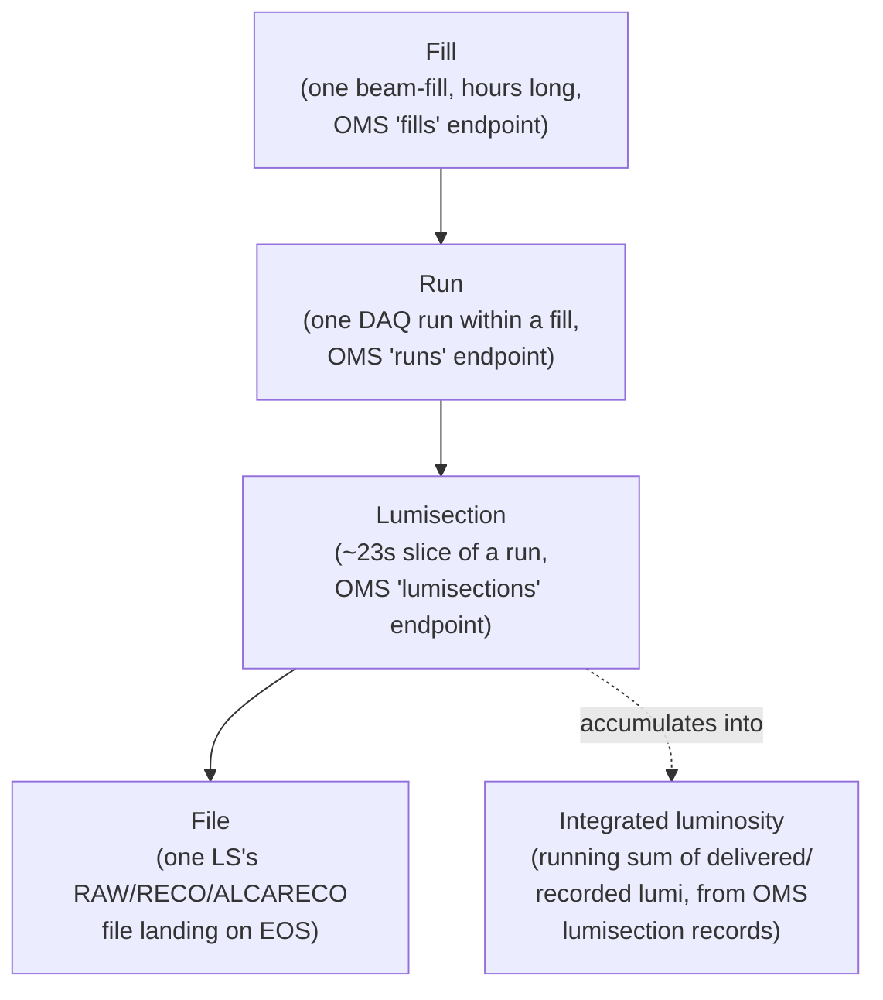
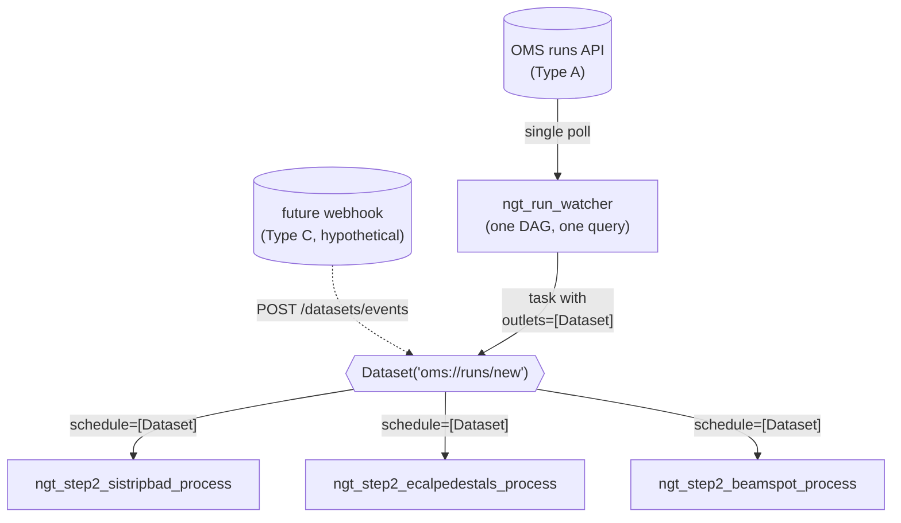

# Trigger types and scheduling architecture options

**Scope note**: Fill, Run, Lumisection, file-arrival, and luminosity-threshold triggering
are **not alternatives to choose between** — a production system eventually needs all of
them, for different workflow types (Steps 2-4 need run + file-arrival today; a future
fill-integrated or statistics-gated calibration would need the others). This document
therefore groups triggering conditions by **detection-mechanism type** — how the condition
is actually observed — and analyzes, for each type, what architecture and Airflow
mechanism serves it best. §4 gives the deepest treatment, since Airflow sensors are the
concrete mechanism available for implementing every type below; §5 separately analyzes how
clearly each mechanism's *outcome* — the status of one specific run, file, fill, or
threshold-crossing — actually shows up in the Airflow UI, since architectural fit and
monitoring clarity don't always favor the same choice. The companion
[`airflow_sensors_guide.md`](airflow_sensors_guide.md) is a full syntax/mechanism reference
for anyone implementing one of these.

## 1. The event hierarchy

CMS/LHC operations events nest strictly, and this is what makes "all of these eventually,
for different workflows" coherent rather than contradictory — each granularity is a real,
distinct level in the same hierarchy, not a competing description of the same thing:



A Fill contains one or more Runs; a Run contains many Lumisections; each Lumisection
produces one RAW file per stream, which after processing produces one RECO/ALCARECO file
per step; integrated luminosity is a running sum of per-LS values, not a discrete container.
Because they nest, a lower-level trigger can always be used to derive a higher-level one
(counting file arrivals tells you about LS progress; summing LS lumi tells you about
threshold crossings) — but not the reverse, which is why file-arrival and API-polling are
analyzed below as the two *primitive* detection types, with Run/Fill/LS/threshold as
different *conditions evaluated from* those primitives, not separate detection mechanisms
of their own.

## 2. Trigger detection types

Every condition in §1 reduces to one of three ways it can actually be observed. This is the
grouping the rest of the document uses.

### Type A — Stateful API polling (pull, request/response against a service)

**Source**: OMS REST endpoints (`runs`, `fills`, `lumisections`) — the only source in this
system for run/fill status and per-LS luminosity values; EOS file listing is *not* visible
through OMS.

**Conditions it serves**: per-run existence/status (used today, `oms.find_new_run` /
`oms.daq_is_running`), per-fill existence/status (not used today — same endpoint family,
`fills` instead of `runs`), per-luminosity-threshold (not used today — sum
`delivered_lumi`/`recorded_lumi` off the `lumisections` endpoint), and per-LS-closed as an
*alternative* to file-arrival (OMS reports `last_lumisection_number` directly, which is
literally how `oms.last_ls_run_number` already gets it — so "has a new LS closed" can be
answered by Type A without ever touching EOS, distinct from "has that LS's *file* landed",
which can only be answered by Type B below and lags the OMS-visible LS closure by however
long the Tier-0 transfer takes).

**Characteristics**: request/response, server-side filterable (`fill_type_runtime`,
`l1_hlt_mode`, `stable_beam` in this repo's existing filters), moderate and roughly
constant per-query cost regardless of how much data exists behind it, schema is stable and
documented, a rate limit is plausible at high polling frequency/subscriber count (nothing
observed yet at this repo's 3-calibration scale, but worth designing around per §4).

### Type B — Filesystem/object-store listing polling (pull, directory listing)

**Source**: EOS, via `xrdfs`/`edmFileUtil` (`eos.py`).

**Conditions it serves**: per-file arrival (used today throughout Steps 2-4), per-LS-file
batch-readiness (same mechanism — "enough new files" is a diff against the processed log),
witness-file completion (the actual dependency signal between steps — Step 3 waits on Step
2's `_job.txt`, etc.).

**Characteristics**: cost scales with directory size (listing gets more expensive as a run
accumulates files — fine at this pipeline's per-run file counts, worth knowing as a
ceiling); no server-side filtering — the caller lists everything under a path and diffs
client-side against the durable "already processed" log; critically, a listing only proves
*presence*, not *write-completion* — this repo's witness-file convention (a separate marker
touched only after the writer finishes) is what actually guards against reading a
partially-written file, and any Type B consumer must keep that convention, not rely on the
listing alone.

### Type C — Push / event notification (webhook, message queue)

**Source**: none exists today for OMS, EOS, or Tier-0/DAQ in this pipeline's context — this
is analyzed for completeness and forward-compatibility, not as something implementable
right now.

**Conditions it could serve**: in principle, any of the above (a "run started" webhook, a
"file transferred" message, a "threshold crossed" event) — *if* the upstream system were
extended to emit it. CMS Tier-0/DAQ does not expose such an interface to this pipeline
today; building one is a CERN-infrastructure project outside this repo's scope, not a
config change.

**Characteristics**: zero polling latency and zero wasted polls when nothing has changed;
in practice almost always paired with a slow reconciliation poll as a fallback (missed
messages, listener downtime) rather than fully replacing Type A/B — so it's additive to
Type A/B, not a substitute for them.

**A structural point that matters for design-now**: Type C is fundamentally different from
A/B in Airflow terms — A and B are *pull*, something has to actively re-check on a timer,
which is exactly what a `Sensor` is for. C is *push*: Airflow should sit passively until
notified, which is not a sensor's job at all (see §4.5). Designing the Type A/B consumers
now around a mechanism that also accepts push updates (Datasets, §4.6) means adopting C
later costs nothing on the consumer side — this is the single biggest reason to prefer
Datasets over ad hoc `TriggerDagRunOperator` fan-out even while everything is still
poll-based.

### 2.1 Type-to-condition matrix

| Condition (§1) | Detected via | Notes |
|---|---|---|
| Run exists / started / ended | Type A (OMS `runs`) | Used today |
| Fill exists / in progress | Type A (OMS `fills`) | Not used today; same mechanism, different endpoint |
| LS closed (DAQ-side) | Type A (OMS `lumisections`, `last_lumisection_number`) | Already queried today, but only as a *cross-check* (`_run_has_ended_and_files_are_ready`'s `last_ls_oms` vs `last_ls_available` comparison), not as the primary trigger |
| File landed on EOS | Type B | Used today, this is the actual `cmsRun` dependency |
| Witness file present (prior step done) | Type B | Used today |
| Integrated luminosity ≥ threshold | Type A (sum over `lumisections`) | Not used today; needs cross-run accumulator state, see `scheduling_options.md`'s earlier per-condition analysis carried into §3 below |
| Any of the above, pushed | Type C | Not available; forward-compatible via Datasets, §4.6 |

## 3. Per-condition notes (kept brief — full pros/cons per granularity previously lived
here; folded into §2's type analysis since the *mechanism*, not the granularity itself, is
what drives the architecture choice)

- **Run** (Type A): matches this pipeline's actual units — IOVs keyed by run number,
  witness/job directories keyed by run number. Already implemented; no change needed.
- **Fill** (Type A, different endpoint): would need a fan-out layer underneath it to reach
  per-run resolution, since a fill bundles several runs — relevant only if a *fill-scoped*
  calibration is added; not needed for Steps 2-4.
- **Lumisection** (Type A for "closed", Type B for "file landed"): correct as a *trigger
  signal* feeding a batching decision (already how this repo uses it), wrong as a
  *workflow-instance* unit (would fight Step 4's whole-batch reprocessing and multiply
  CMSSW job-startup overhead — same conclusion as before).
- **File arrival** (Type B): the actual dependency signal; correctly used today.
- **Luminosity threshold** (Type A, new accumulator): the one condition here that requires
  genuinely new *state* (an accumulator that can span run boundaries), not just a new
  filter or a new DAG — a real design addition when it's needed, not a drop-in config
  change like Fill is.

## 4. Airflow mechanism analysis per type

This is the expanded core of the document. `airflow_sensors_guide.md` has full syntax;
this section is the *why*.

### 4.1 The three ways to make Airflow "wait," independent of type

| Mechanism | Worker slot while waiting | Extra process needed | Cross-DAG fan-out |
|---|---|---|---|
| Cron-scheduled DAG (short-lived, checks once, exits) | None | None | Manual (`TriggerDagRunOperator` per subscriber) |
| `Sensor`, `mode="reschedule"` | None between pokes | None | None — scoped to one DAG |
| Deferrable `Sensor`/`Trigger` (async) | None, ever | `airflow triggerer` | None — scoped to one DAG |
| `Dataset`-scheduled DAG | None — consumer doesn't run until the event fires | None | **Built-in**, N consumers per producer |

`mode="poke"` is omitted deliberately — it holds a worker slot for the entire wait and is
unsuitable for anything in this pipeline (waits routinely span hours). See
`airflow_sensors_guide.md` §3 for why.

### 4.2 Type A (API polling) via Airflow

Best fit: `PythonSensor` (or, equivalently, the cron-scheduled-DAG pattern already used)
wrapping the existing synchronous `oms.py` functions directly — no rewrite needed. A
built-in `HttpSensor` was considered and rejected: it's built around raw HTTP +
`response_check`, and `oms.py` already wraps the `omsapi` client's query-building
(`.filter()`, `.sort()`, `.paginate()`), so re-plumbing through `HttpSensor` would fight the
existing abstraction rather than reuse it. Deferrable mode is *possible* in principle but
would need an async HTTP client (`aiohttp`) to get its full benefit, since a sync call
inside an async `run()` blocks the triggerer's *shared* event loop for every other pending
trigger, not just its own — not worth it at this repo's current polling scale (see
`airflow_sensors_guide.md` §5's caveat). **Recommended**: keep the cron-DAG pattern for
single-consumer conditions (as today); move to a `Dataset`-producing task (§4.6) once a
Type A condition needs to wake more than one consumer DAG, e.g. if Fill-level or
threshold-level triggers are added alongside the existing run-level ones and several
calibrations need to react to the same OMS signal.

### 4.3 Type B (filesystem polling) via Airflow

Same shape as Type A: `PythonSensor` wrapping `eos.py`'s existing functions, `mode=
"reschedule"`. A built-in `FileSensor` was considered and rejected for the same reason as
`HttpSensor` above — it expects a standard Airflow `Connection`/hook (local filesystem,
SFTP, cloud object storage), and this repo accesses EOS by shelling out to `xrdfs`/
`edmFileUtil` directly (matching the existing fake-toolchain design used throughout
testing) rather than through an Airflow-native storage hook; wrapping the existing
functions is less code than building a custom `FSHook` for xrootd just to use the built-in
sensor's plumbing. Deferrable mode has the same async-rewrite caveat as Type A.

### 4.4 Cron-DAG vs literal `Sensor` for Type A/B — which one, when

Both give "no worker slot held while waiting," so the choice isn't about efficiency — it's
about what the condition is *scoped to*:

- **Cron-scheduled DAG** (used today for `_latch`): right when the condition has **no
  specific entity to attach a task to yet** — "is there a new run *at all*" doesn't belong
  inside any particular run's processing DAG, because which run it'll find is exactly what
  it's discovering.
- **Literal `Sensor`, inline in a DAG**: right when the condition is scoped to an
  **already-known entity within that DAG run** — e.g., a hypothetical
  `wait_for_next_ls_batch` sensor task living inside a specific run's own `_process` DAG,
  blocking that run's next task on that run's own file listing. This repo's current design
  actually achieves the equivalent of this without a literal `Sensor` at all: `check_and_
  batch` runs once, decides "wait" vs "batch" vs "final," and `advance` retriggers the
  whole process DAG for another cycle if the decision was "wait" — a poll loop expressed as
  DAG retriggering rather than as a task-level sensor. Functionally equivalent to
  `mode="reschedule"`, implemented via a different, already-in-place mechanism; not a gap
  to fill, just worth naming explicitly since the ask here was to analyze sensors thoroughly
  and this is the reason literal `Sensor` operators don't currently appear in
  `airflow_dags/ngt_dags.py`.

### 4.5 Type C (push) — not a sensor problem at all

A `Sensor`'s entire contract is "poll a condition repeatedly." A genuine push doesn't need
anything polling — it needs Airflow to be a **passive receiver**:

- If the pusher should start one specific DAG: it calls Airflow's REST API directly,
  `POST /api/v1/dags/{dag_id}/dagRuns`, with no Airflow-side component running at all
  between events (not a sensor, not a `Trigger` — literally nothing waits).
- If the pusher's event should fan out to several subscriber DAGs: it calls
  `POST /api/v1/datasets/events` instead, and every DAG already scheduled on that
  `Dataset` (§4.6) picks it up exactly as if a poll-based producer had updated it — the
  fan-out logic doesn't need to know or care whether the update came from a poll or a push.
- The one case that *does* involve a Sensor-adjacent mechanism is a message broker
  (Kafka/RabbitMQ) that Airflow must actively subscribe to rather than being called by —
  that's a deferrable `Trigger` whose `run()` is an async subscriber loop rather than a
  poll loop (same shape as §4.2/§4.3's deferrable sketch, but `await queue.get()` instead
  of a periodic check).

Since none of Type C exists yet for this pipeline, no implementation is proposed here — the
point of this subsection is that **when** it exists, the two poll-based types above should
already be built on `Dataset`s specifically so that push can be adopted by changing only the
*updater*, not any consumer DAG.

### 4.6 Datasets — the mechanism that generalizes across all three types

Airflow's data-aware scheduling (`Dataset`, 2.4+) is the concrete built-in version of "one
entity polls (or is pushed to), then triggers every workflow subscribed to that condition,"
which is exactly what was asked for. A producer task declares `outlets=[Dataset(...)]`;
every DAG that lists that same `Dataset` in its own `schedule=` gets a new run the moment
the producer succeeds — no hand-written subscription registry, no per-subscriber
`TriggerDagRunOperator` call to maintain, and it shows up natively in the Airflow UI's
Datasets view (which DAGs produce/consume which datasets, at a glance).



This is a direct upgrade over a hand-rolled "watcher + config registry + fan-out trigger
loop": the registry *is* each consumer's own `schedule=` declaration, kept next to the
consumer's own code instead of centralized in the producer. See
`airflow_sensors_guide.md` §8 for full syntax including conditional (`&`/`|`) dataset
expressions.

**Tradeoff, stated plainly**: this introduces a shared detection component (the producer
task) whose failure affects every subscriber, same blast-radius tradeoff as any shared
poller — mitigated the same way any critical DAG is (alerting on failure, its own
`retries`), not eliminated by using `Dataset`s instead of hand-rolled fan-out.

### 4.7 `TriggerDagRunOperator` vs `Dataset` vs `Sensor` — decision guide

- **`TriggerDagRunOperator`**: this run knows exactly *one* specific downstream DAG run to
  start, with `conf` to hand it — this repo's `advance` task (retrigger self for another
  cycle, or hand off to the next step) is exactly this shape and should stay as-is.
- **`Dataset` schedule**: one upstream event, multiple independent consumers, no bespoke
  per-consumer `conf` needed — the shape for a shared run/fill/threshold watcher feeding
  several calibrations' process DAGs.
- **`Sensor`**: blocking one DAG's own next task on a condition scoped to that DAG run —
  not a cross-DAG mechanism, unlike the other two.

## 5. Monitoring and UI clarity per approach

The question that matters operationally isn't just "does the condition get detected" but
"given one occurrence of it — run 398600 latched, a specific file arrived, a fill started,
a threshold crossed — can an operator find the corresponding workflow run(s) in the Airflow
UI and read their status, without opening logs?" This is a real axis the earlier sections
didn't cover, and it doesn't always favor the same mechanism that wins on architecture
grounds.

### 5.1 What's implemented today: run_id-embedded traceability (a genuine strength)

`_trigger_process_dag` (`airflow_dags/ngt_dags.py`) sets both the triggered DAG run's
`run_id` and its `conf` from the run number:

```python
run_id = f"run{run_number}__cycle{cycle}__{stamp}"
trigger_dag(dag_id=process_dag_id, run_id=run_id, conf={"run_number": str(run_number), "cycle": cycle})
```

Because `run_number` is baked directly into the `run_id` string, an operator can open
`ngt_step2_sistripbad_process`'s Grid view (or Browse → DAG Runs, which supports filtering
by Run Id) and search `run398600` to see **every cycle of that run's processing in one
place**, each labeled with its own cycle number — no log-reading required. `max_active_runs
=10` on the process DAG (`airflow_dags/ngt_dags.py:295`) means several runs' cycles can be
interleaved in that same flat list at once; distinguishing them still only costs reading the
`run_id` text, not opening anything. `check_and_batch`'s `action`/`batch` XCom and
`finalize_cycle`'s `is_final` XCom (both pushed with explicit keys) are also directly
inspectable per cycle from the UI's XCom tab — an operator can see *what a given cycle
decided to do* (wait / batch / final, and exactly which files/LS) without reading its task
log either. This traceability wasn't a stated design goal in the original plan, but it falls
out of choosing `TriggerDagRunOperator`/`trigger_dag` with an explicit, content-bearing
`run_id`, and is worth preserving deliberately in any future change (§5.7).

### 5.2 Weak point: file-level (Type B) traceability

There is no 1:1 DAG-run-per-file unit — by design, per §3's granularity analysis (a
per-file trigger would fight batching and multiply job overhead). A specific file's fate is
only visible by finding which cycle's `batch` XCom in a run's chain lists it — doable, but
it means scanning cycles rather than looking up one index. This is an accepted cost of the
batching decision, not an oversight, but worth naming plainly: **Type A (run-level)
traceability is close to free here; Type B (file-level) traceability requires manual
correlation.**

### 5.3 The latch DAG's own visibility: noisy, and carries no identity

The `_latch` DAGs run on a fixed 30s cron and raise `AirflowSkipException` when nothing is
found (`airflow_dags/ngt_dags.py:136-137`) — most ticks render as Airflow's "skipped" color
in the Grid view (visually distinct from success, so a human scanning the Grid can tell
"quiet" from "did something" at a glance), but a latch DAG run itself carries no run number
in its own `run_id` or `conf` — only the process DAG run it *triggers* does. So "when did we
latch onto run 398600" is answerable from the process DAG's first cycle (`cycle0`) but not
by searching the latch DAG directly; finding *that* still means opening the one specific
latch run's log. There is also no timeout/alerting concept at this layer at all today: if a
run should have been latched and wasn't (misconfigured OMS filter, for instance), the latch
DAG just keeps ticking "skipped" forever, indistinguishable in the Grid from the healthy
"nothing new yet" case — a real monitoring gap relative to what a literal `Sensor`'s
`timeout` would surface (§5.4).

### 5.4 Literal `Sensor` (reschedule mode): collapses polling history, adds a real timeout signal

A `Sensor` scoped to a known entity (e.g., a hypothetical `wait_for_next_batch` sensor
living inside one run's own process DAG) shows as **one task row** for the entire wait;
individual poke attempts appear as numbered "tries" inside that task's own log tab, not as
separate Grid cells — tidier than the cron-DAG's long tail of mostly-skipped rows, but at
the cost of needing one click to see how the wait actually progressed (vs. the cron-DAG's
history being visible at the top level for free). The real gain: `timeout=`/`soft_fail=`
give a **visible, distinct failure or skip state** if the condition never arrives — exactly
the capability §5.3 notes the current latch pattern lacks.

### 5.5 Deferrable `Sensor`/`Trigger`: the clearest single-state signal, with a caveat

A deferred task renders in its own distinct state/color in the Grid — arguably the clearest
"this specific, already-known thing is actively being awaited" signal among every mechanism
analyzed here, since it's one first-class state rather than something inferred from a skip
pattern or a queued/running oscillation. The caveat: a task stuck in `deferred` could mean
either "genuinely still waiting" or "the `triggerer` process is down" — telling those apart
needs the triggerer's own logs/health, a separate operational surface from the DAG UI
itself, and one this repo doesn't currently run (per the plan's explicit "no triggerer
needed" decision).

### 5.6 Datasets fan-out: best for "which workflows react to this," weaker for "which occurrence"

The Datasets view gives a native, explicit producer/consumer graph — a real strength over
`TriggerDagRunOperator`, where "who triggers whom" is implicit in code and not rendered
anywhere in the UI as a static picture. The trade-off: a Dataset-triggered consumer DAG run
gets an Airflow-assigned `run_id`/timestamp, not the caller-chosen, content-bearing one
§5.1 relies on — so adopting Datasets for the run-latch fan-out (§4.6) would, out of the
box, **lose** the "search Grid by run_number" clarity that's currently a free side effect of
using `trigger_dag(run_id=...)` directly. Recent Airflow versions support attaching `extra`
metadata to a dataset event for this kind of traceability, but exactly what 2.10.5 supports
here should be verified against its docs/changelog before relying on it — as of this
analysis it's a real trade-off to weigh, not something to assume is already solved by moving
to Datasets.

### 5.7 Summary table

| Mechanism | Find "the run for condition X" at a glance? | Polling history visible in UI? | Failure/timeout surfaced if condition never happens? | Multi-consumer fan-out visible as a graph? |
|---|---|---|---|---|
| Cron-DAG latch (used today) | No — latch runs carry no identity | Yes — one row per check | No — ticks forever | No — implicit in code only |
| Process DAG chain (used today — explicit `run_id`/`conf`) | **Yes** — Grid/DAG-Runs search by run number | Yes — one row per cycle, XCom shows each cycle's decision | Partial — `execution_timeout` on job tasks only, not "run never appeared" | No — implicit in code only |
| `Sensor`, `mode="reschedule"` | Only if scoped to an already-known entity | Only inside one task's log tries | **Yes** — `timeout`/`soft_fail` | No |
| Deferrable `Sensor`/`Trigger` | Same as reschedule | No — inside the triggerer's own logs | **Yes** | No |
| `Dataset`-scheduled consumer | Not by default — needs deliberate extra-metadata work | Depends on the producer's own mechanism | Depends on the producer | **Yes** — native Datasets view |

### 5.8 Implication for the roadmap (§6)

Any move toward Datasets for the run-latch fan-out (§4.6) should explicitly preserve §5.1's
traceability rather than trade it away implicitly: either confirm and use 2.10.5's
dataset-event `extra` metadata to carry the run number through to the consumer, or have
each Dataset-triggered consumer's very first task immediately re-derive and
`xcom_push`/log the run number so it's still one click away even without a
content-bearing `run_id`. The per-run processing *chain* itself (`advance`'s
`TriggerDagRunOperator`-equivalent handoff) should keep its current explicit `run_id`
regardless — that traceability isn't in tension with adopting Datasets purely at the
detection/fan-out layer, only with using Datasets for the per-run chain itself, which §4.7
already recommends against for unrelated (1:1-vs-fan-out) reasons.

## 6. Recommendations / roadmap

| Condition | Type | Today | If/when it needs to scale or be added |
|---|---|---|---|
| Run latch | A | Cron-DAG per calibration (§4.4) | `Dataset`-producing watcher (§4.6) once calibration count makes redundant OMS polling material |
| File-batch readiness | B | Inline in each run's own `_process` DAG cycle (§4.4) | No change — inherently per-run-chain, no cross-DAG sharing benefit |
| Witness-file dependency | B | Same as above | No change |
| Fill latch (new) | A, different endpoint | Not implemented | Same `PythonSensor`/cron-DAG pattern as run latch, at the `fills` endpoint; needs its own run-enumeration fan-out underneath since a fill isn't itself a DAQ data unit |
| Luminosity-threshold trigger (new) | A, new accumulator | Not implemented | Same Type A mechanism, but needs a durable cross-run accumulator — the one genuine state addition among these, not just a new DAG |
| Push (new, CERN-side dependent) | C | Not available, out of this repo's control | If it appears: wire the pusher to `POST /datasets/events` against the *same* Datasets already used for Type A/B, so no consumer DAG changes |

**Bottom line**: build any new shared-detection component on `Dataset`s (§4.6) rather than
a hand-written registry, specifically because it is the one mechanism here that serves
Type A, Type B, *and* Type C uniformly — the producer can be a poll (today) or a push
(later) and every consumer DAG's `schedule=[Dataset(...)]` declaration doesn't change
either way. Everything else in this table is either already correctly implemented (run
latch, file-batch readiness) or a config/endpoint addition using a pattern already analyzed
here (Fill), except the luminosity-threshold accumulator, which is the one item that's a
genuine new piece of durable state, not just new wiring. **Carry §5.8's caveat along with
that move**: adopting `Dataset`s for the run-latch fan-out must deliberately preserve the
explicit-`run_id` traceability §5.1 documents as already working today — it is not
preserved automatically by switching mechanisms.
